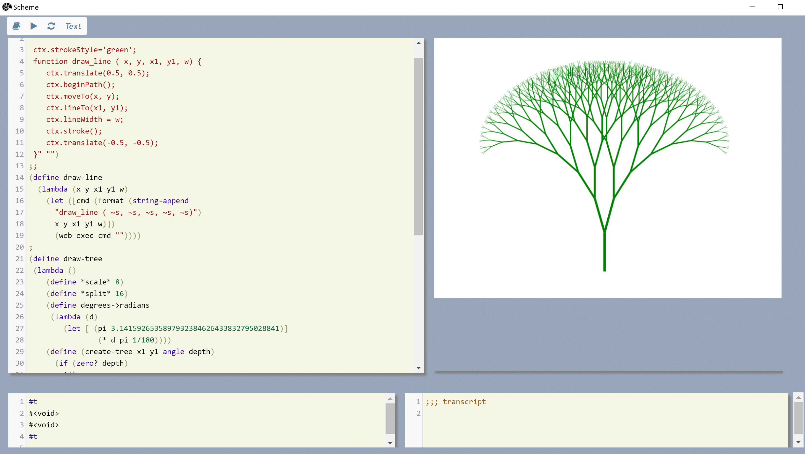

## **Web view to scheme interface**

### web-exec 

*executes JavaScript in the browser.*

***web-exec**** function-string callback-name

e.g.

```scheme
(define name "")
(define catch-name-for-later
 (lambda (result)
   (set! name result)))  
;;
(web-exec 
 "prompt('Please enter your name', 'Harry Potter')"
 "catch-name-for-later")
;;
```

Will display an input prompt; and later call back the function to save the results.

The optional call back name can be left blank as an empty string; if you don't care about catching the results.

#### Limitations of web-exec

- This function *forces the browser to execute a script*; and that does block the browsers own event loop.
- The function includes a delay; but you should be wary when putting web exec statements into something like a dotimes loop.
- The web execs are already throttled from running at an insane rate; there is a limit on how many calls you can send per second.

### The sleep function

**sleep** ms

- This can be used in a scheme function to introduce a delay *that does not block the browser user interface thread*.
- This *does not give up control of the scheme thread*.
- When working with a web view control; you should avoid long running functions on either the scheme side; or the browser side; but if you do; and assuming you want to avoid the browser from becoming non-responsive; you can periodically sleep.   Assuming the browser is trying to talk to scheme; it could *still start to block*; since scheme itself i*s busy while sleeping*.
- This will pause whatever scheme is doing for at least **ms** milliseconds; while keeping the event loop alive; this gives the browser back some time to redraw itself; while your scheme script runs.

**yield** ms

This function sleeps as above; and also releases the scheme thread lock; meaning that another scheme function *could then run*;however this is only relevant *if there is more than one thread in play*; which there is  not (yet.)

Another way of thinking about yield; i*s that we are migrating the windows message loop around* in our program.

---

#### Examples of using web-exec  

##### Use Canvas to draw the letter M.

```Scheme
;; example send 10 separate commands to draw the letter M.
(web-exec "ctx.fillStyle = 'green';" "")
(web-exec "ctx.fillRect(0, 0, canvas.width, canvas.height);" "")
(web-exec "ctx.beginPath();" "")
(web-exec "ctx.moveTo(90, 130);" "")
(web-exec "ctx.lineTo(95, 25);" "")
(web-exec "ctx.lineTo(150, 80);" "")
(web-exec "ctx.lineTo(205, 25);" "")
(web-exec "ctx.lineTo(210, 130);" "")
(web-exec "ctx.lineWidth = 15;" "")
(web-exec "ctx.stroke();" "")
(display "finished M")
```

When this executes: it triggers one call from the browser; and 10 web calls from scheme back to the browser to draw the letter M.

The letter M was brought to you today by Mozilla from their JavaScript canvas API documents.

-------

**Make some graphics procedures**

Create a function in the browser to draw a line; and a scheme function to execute it.

```Scheme
(web-exec 
 "
 ctx.strokeStyle='green';
 function draw_line ( x, y, x1, y1, w) {
    ctx.translate(0.5, 0.5);
 	ctx.beginPath();
    ctx.moveTo(x, y);
    ctx.lineTo(x1, y1);
    ctx.lineWidth = w; 
    ctx.stroke();
 	ctx.translate(-0.5, -0.5);
 }" "")
;;  
(define draw-line
  (lambda (x y x1 y1 w)
	(let ([cmd (format (string-append
      "draw_line ( ~s, ~s, ~s, ~s, ~s)")
      x y x1 y1 w)])
      (web-exec cmd ""))))
;;
```

##### Now use the line drawing function

```Scheme
;;
(define draw-tree
 (lambda ()
	(define *scale* 8) 
	(define *split* 16)  
	(define degrees->radians 
	 (lambda (d)
		(let [ (pi 3.1415926535897932384626433832795028841)]
				(* d pi 1/180))))
	(define (create-tree x1 y1 angle depth)
	  (if (zero? depth)
		'()
		(let ([x2 (+ x1 (* (cos (degrees->radians angle)) depth *scale*))]
			    [y2 (- y1 (* (sin (degrees->radians angle)) depth *scale*))])
		  (append (list (map truncate (list x1 y1 x2 y2 depth)))
				  (create-tree x2 y2 (- angle *split*) (- depth 1))
				  (create-tree x2 y2 (+ angle *split*) (- depth 1))))))

	(define tree (create-tree 350 480 90 10))
	
	(define draw-a-line 
		(lambda (x y x1 y1 w) 
		  (draw-line 
			x y x1 y1 (/ w 2))))

	(define get-line 
	  (lambda (x) 
		(apply draw-a-line x)))
   
	(map get-line tree) #t))

(draw-tree)
```

----------------

#### An image on the canvas.

 

If you run this you will note how the tree is slowly drawn; line by line; each line is creating a request to the browser; and that function has a delay; to prevent it overwhelming the web view control.

The slow drawing is a nice effect; but if you wanted speed; you could draw the object; with one call; a simple approach is to generate a command list first then send that.

```Scheme
;; create a list of graphics commands and execute them.
;; assumes function draw_line defined in browser 
(define draw-tree-fast
  (lambda ()
    (define *scale* 8)
    (define *split* 16)
    (define command-list '())
    (define add-draw-line
      (lambda (x y x1 y1 w)
        (let ([cmd (format
                     (string-append "draw_line ( ~s, ~s, ~s, ~s, ~s);\n") x
                     y x1 y1 w)])
          (set! command-list (cons cmd command-list)))))
    (define degrees->radians
      (lambda (d) (let ([pi 3.141592653589793]) (* d pi 1/180))))
    (define (create-tree x1 y1 angle depth)
      (if (zero? depth)
          '()
          (let ([x2 (+ x1
                       (* (cos (degrees->radians angle)) depth *scale*))]
                [y2 (- y1
                       (* (sin (degrees->radians angle)) depth *scale*))])
            (append
              (list (map truncate (list x1 y1 x2 y2 depth)))
              (create-tree x2 y2 (- angle *split*) (- depth 1))
              (create-tree x2 y2 (+ angle *split*) (- depth 1))))))
    (define tree (create-tree 350 480 90 10))
    (define draw-a-line
      (lambda (x y x1 y1 w)
        (add-draw-line x y x1 y1 (exact->inexact (/ w 2)))))
    (define get-line (lambda (x) (apply draw-a-line x)))
    (map get-line tree)
    (web-exec (apply string-append command-list) "")
    #t))

(draw-tree-fast)
```

That displays the same tree pattern all at once; by sending one long command to the browser.

-------------------


**Display things on the transcript** pane

**When you display output it ends up by default on the transcript pane.*

```Scheme
;; display multiplication tables
(for a from 2 to 12 
   (display "The " ) 
   (display a)
   (display " times table.")
   (newline)
   (for b from 1 to 12 
        (display a)
        (display " x ")
        (display b)
        (display " = ")
        (display (* a b ))
        (newline))  (newline))     
```

This is an example of an un-scheme-like; imperative for loop; and a couple of simple output commands.  One nice thing about the **display** procedure is that it does attempt to display whatever object you give it.

The transcript presently collects up all the output; that output is only requested by the browser after the whole evaluation has finished.  This will be changed soon to use the communications channel to do an update when the display command runs.

A less primitive way to format output is to use the format statement; which is based on the one from common lisp.

https://www.scheme.com/csug8/io.html#./io:h13

http://www.lispworks.com/documentation/HyperSpec/Body/22_c.htm

That does also allow you to format numbers as roman numerals and other useful things.

---

